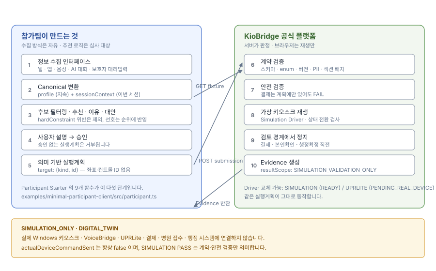

<!--
  ⚠️ 자동 생성 파일 — 직접 수정하지 마세요.
  이 폴더는 원본 스키마/문서에서 자동 생성됩니다.
  원본을 수정한 뒤 `npm run sync:contracts` 를 실행하세요.

  generatedAt        : 2026-08-03T13:10:52.926Z
  contractVersion    : 1.0.0
  generatorVersion   : 1.0.0
-->

# 00. 여기서 시작하세요

> 제품 버전 `5.1.4` · 입력계약 버전 `1.0.0`

## 읽는 순서

| 순서 | 문서 | 왜 |
| --- | --- | --- |
| 1 | [README_FIRST.md](README_FIRST.md) | 실행 방법 |
| 2 | [QUICK_START_10_MINUTES.md](QUICK_START_10_MINUTES.md) | 10분 안에 왕복 한 번 |
| 3 | [WHAT_WE_PROVIDE.md](WHAT_WE_PROVIDE.md) | KioBridge 가 주는 것 |
| 4 | [WHAT_YOU_BUILD.md](WHAT_YOU_BUILD.md) | 참가팀이 만들 것 |
| 5 | [FULL_DEMO_FLOW.md](FULL_DEMO_FLOW.md) | 전체 흐름 상세 |
| 6 | [PASS_SCOPE.md](PASS_SCOPE.md) | PASS 가 뜻하는 범위 |
| 7 | [PRIVATE_EVALUATION_BOUNDARY.md](PRIVATE_EVALUATION_BOUNDARY.md) | 공개/비공개 경계 |

## 폴더 안내

| 폴더 | 내용 |
| --- | --- |
| `00_START_HERE` | 여기서 시작 |
| `01_ENVIRONMENT_AND_FIXTURE` | 환경과 Fixture |
| `02_API_CONTRACT` | 공식 API |
| `03_SEMANTIC_ACTION` | 의미 기반 Action |
| `04_PROFILE_AND_INPUT_CONTRACT` | Canonical Input Contract |
| `05_SAFETY_AND_BOUNDARY` | 안전경계 |
| `06_EVIDENCE_AND_EVALUATION` | Evidence 와 평가 |
| `07_PARTICIPANT_STARTER` | Starter 코드 |
| `08_EXTENSION_AND_CUSTOMIZATION` | 확장과 커스터마이즈 |
| `09_TROUBLESHOOTING` | 문제 해결 |

## 기억할 한 가지

> 참가팀은 좌표나 실제 키오스크 컨트롤을 다루지 않습니다.
> 의미 기반 Action 만 제출하며, 실행은 KioBridge Driver 가 담당합니다.
